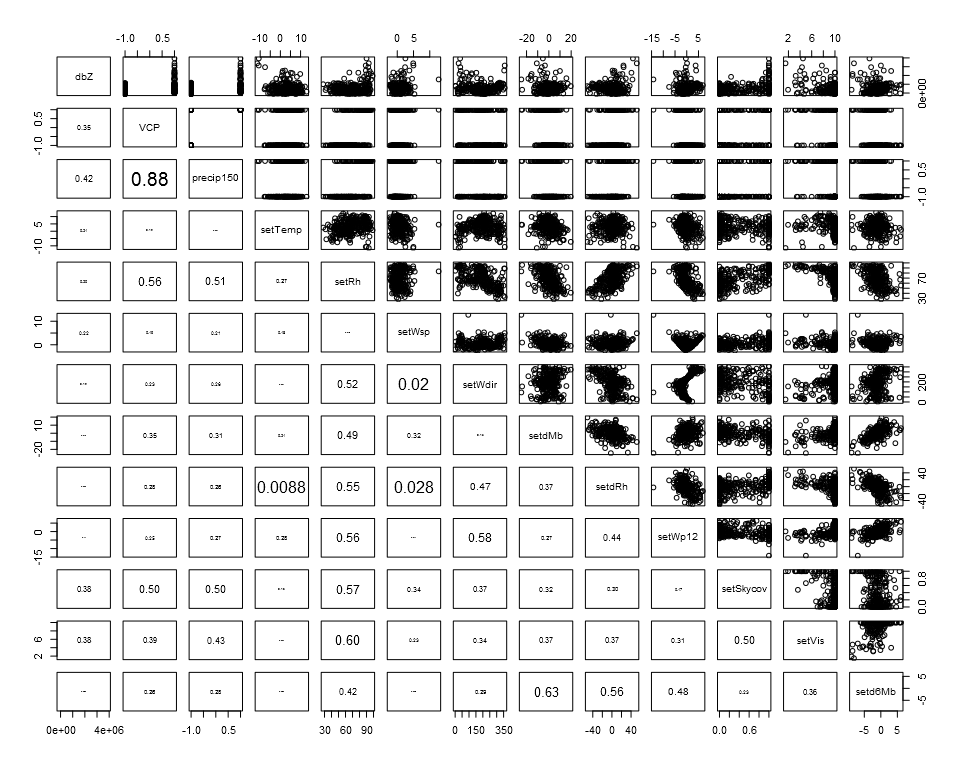
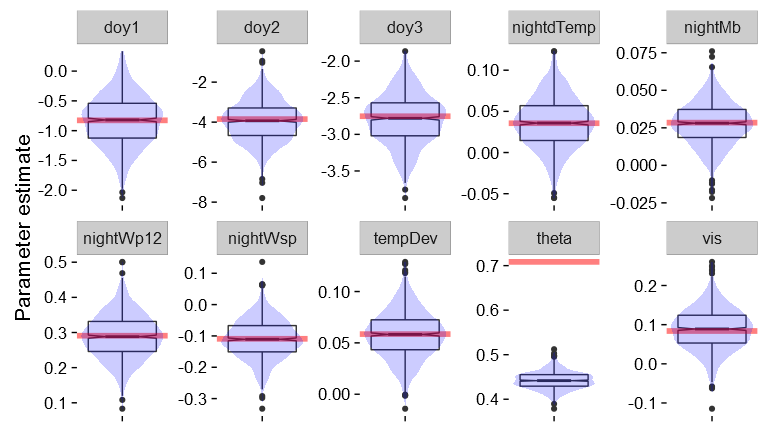
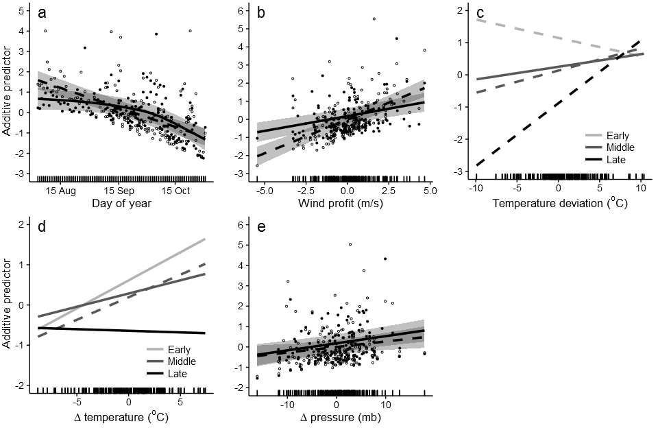
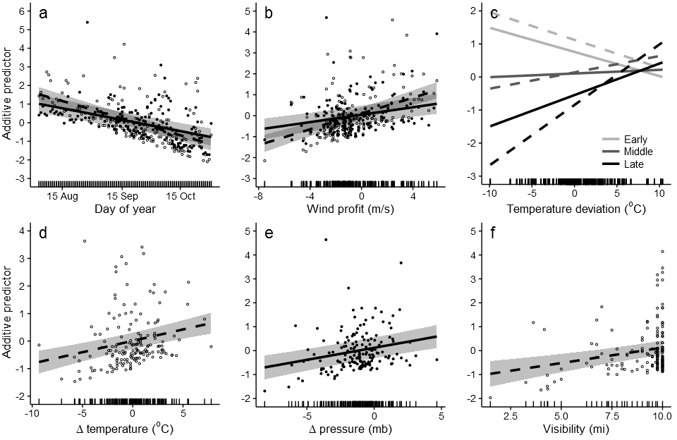
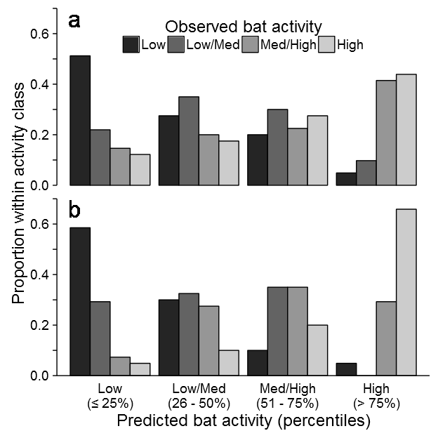

Supporting Information S2. Overview of the analysis of coastal bat acoustical activity.

We provide a brief overview of the analysis of bat acoustical activity as it relates to regional atmospheric conditions.  The code and data referenced herein and necessary to reproduce this document and the full analysis are available freely at [https://github.com/adamdsmith/Bat_migration_acoustics](https://github.com/adamdsmith/Bat_migration_acoustics).

# Weather and radar data manipulation and consolidation

We do not run this source code as it takes some significant computation time.  We provide the raw data only for the temperature deviation calculation (calculate_temperature_deviation.R), although the raw data for the 1- and 5-minute ASOS and NEXRAD analysis are available from the corresponding author. 


```r
# Consolidate, organize, and calculate derived variables from 1-minute ASOS 
# data; produces ASOS1.rda
source("./Source/read_ASOS1.R")

# Use ASOS1 to calculate regional nightly averages of weather variables
# Produces weatherVars.rda
source("./Source/nightly_weather_ASOS1.R")

# Consolidate, organize, and calculate derived variables from 5-minute ASOS 
# data; produces ASOS51.rda and nightSky.rda
source("./Source/nightly_weather_ASOS5.R")

# Calculate daily high temperature deviation from the 30-year average for a 
# given day; produces tempResids.rda
source("./Source/calculate_temperature_deviation.R")

# NEXRAD radar scan manipulation and reflectivity calculations
# Produces NEXRAD_reflectivity.rda
source("./Source/radar_assessment.R")

# Consolidate 1- and 5-minute ASOS, temperature deviation, and radar data
# Also calculates pre-sunset regional measurements for weather variables
# Produces allWeather.rda
source("./Source/consolidate_all_weather.R")
```

# Explore the weather data

Here we plot the weather data and look for collinearity among predictor variables for the nightly average analysis (objective 1) as well as pre-sunset analysis (objective 2).  For nightly and sunset variables, temperature was *strongly* collinear (VIF > 17 and > 9, respectively), particulary with date (dd), so we excluded it first.  Relative humidity was slightly collinear (VIF > 3) with a few variables in both data sets (e.g., wind profit, visibility, delta RH), so it was subsequently dropped as well.


```r
load("./Data/allWeather.rda")

source("./Source/explore_weather_data.R")
```

```
## Nightly average weather variables                 VIF
## nightTemp  17.048783
## nightRh     3.292303
## nightWsp    2.138497
## nightMb     1.927280
## nightWp12   2.220931
## nightdTemp  2.866751
## nightdMb    2.264225
## nightdRh    1.842379
## propPrecip  2.455548
## tempDev     3.095312
## skycov      2.585033
## vis         1.833971
## dd         13.072772
```

<!-- -->

```
## Pre-sunset weather variables                VIF
## tempDev    3.934461
## Z          1.375173
## precip150  1.733113
## setTemp   13.080899
## setRh      3.573347
## setWsp     1.487978
## setMb      1.820032
## setdTemp   2.372749
## setdRh     2.075608
## setWp12    1.900144
## setSkycov  2.264015
## setVis     1.841139
## setd6Mb    1.951244
## dd         9.040850
```

<!-- -->

# Combine weather data and bat data

With the weather predictors finalized, we consolidate them with the bat acoustic activity data.


```r
# Load bat data
load("./Data/bats.rda")

source("./Source/merge_bats_weather.R") # Produces batsWeather.Rda
```

# Bat and weather assessment

## Generalized additive mixed models

Now we construct the generalized additive mixed models (GAMMS) that (1) associate nightly bat activity with nightly averaged regional weather variables and (2) use pre-sunset regional weather variables to anticipate bat activity in the forthcoming night.  It calculates four GAMM models - nightly and pre-sunset GAMMs for high and low frequency bats.  Additionally for the pre-sunset GAMMs, it calculates a leave-one-out cross-validated prediction assessment.  We do not run the source code here, but the reader can easily do so by uncommenting the appropriate source lines below.  

Prior to fitting the GAMMs, the code calculates the nightly totals of high and low frequency bat passes and the number of active detectors (used as an offset in the GAMM models). It also scales the nightly and pre-sunset weather variables. Additionally, it evaluates overdispersion under a Poisson model and negative binomial model. In all Poisson models, overdispersion was extreme (i.e., ratio of the sum of squared Pearson residuals to the residual degrees of freedom > 48). The negative binomial models provided much better fits (i.e., all ratios < 1.4).


```r
# Produces bat_activity_gamms.rda
# Contains the scaled nightly and pre-sunset data sets, the high and low 
# frequency nightly and pre-sunset generalized linear mixed models (used 
# to generate an estimate for the negative binomial theta parameter in 
# the corresponding GAMMs), the high and low frequency nightly and 
# pre-sunset GAMMs, and the high and low frequency pre-sunset cross-
# validation results.
source("./Source/bat_activity_gamms.R")
```

## Model validation and results

With the GAMM models fitted, we evaluate several aspects of the model to visualized their appropriateness.  Contained in the bat_activity_gamms.R source code are diagnostic plots of the model fit produced by the `rqgam.check` function of the `dsm` package.  All model fits seem adequate.  We show only one example here, that of the high frequency nightly model, although the others are in the `Rpubs/figs` directory of GitHub repository linked at the beginning of this document.


```r
load("./Output/bat_activity_gamms.rda")

# High frequency nightly GAMM
dsm:::rqgam.check(HF_nightGAMM$gam)

# Low frequency nightly GAMM
#dsm:::rqgam.check(LF_nightGAMM$gam)

# High frequency pre-sunset GAMM
#dsm:::rqgam.check(HF_sunsetGAMM$gam)

# Low frequency nightly GAMM
#dsm:::rqgam.check(LF_sunsetGAMM$gam)
```

<!-- -->

We were concerned that the incomplete sampling over time and among sites, or the delayed start of monitoring in 2010 and 2011, may introduce bias into our estimated association between atmospheric conditions and bat  activity.  Additionally, our GAMM models used penalized quasi-likelihood (PQL), which can produce biased parameter estimates in certain conditions (see Bolker et al. 2009 citation in Supporting Information S1).  Thus, to evaluate potential bias in parameter estimates due to these factors, we bootstrapped 1,000 complete data sets (i.e., from 2 Aug to 31 Oct of each year at all stations).  We then specified *a priori* associations between weather variables and bat activity in this full data set and then filtered each data set to match the sampling structure of our data.  We also explored the effect of using known and estimated theta for the negative binomial distribution.  This evaluation revealed essentially no bias in the estimated associations between atmospheric conditions and bat activity.  We present the outcome for the filtered data set and estimated theta here, but do not source the code as it takes many hours to complete.  The horizontal red bar in each panel represents the "true" parameter value used to simulate the complete data set and the violin plots represent the distribution of each parameter as estimated from the filtered model.

<!-- -->

With model adequacy established, we can view the relationships from the model fits (figures 3 and 4 in the manuscript).

<!-- -->

<!-- -->

For the predictive pre-sunset models, we also visualize certain aspects of the predictions.  First, we can visualize observed vs. predicted bat activity and identify the quantiles used to categorize the predictions into activity classes (figure 5 in manuscript).

<!-- -->

Based on this compartmentalization, we can view the assessment of predictive accuracy based on the leave-on-out cross-validation (figure 5 in the manuscript).

<!-- -->
